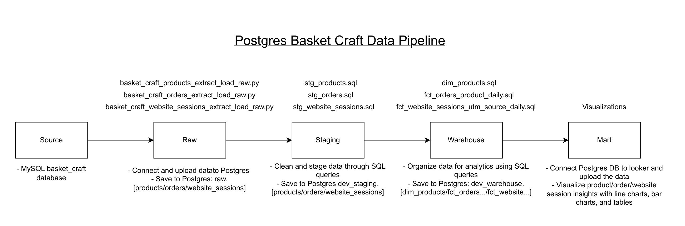

# Basket Craft Data Pipeline

## Project Summary

This project implements an analytics pipeline for the website_sessions data from basket_craft. The pipeline replicates real-world responsibilities of data analysis and data engineers. The data was extracted from a MySQL database for products, orders, and website sessions, and loaded into raw tables in Postgres using python. DBT was used to build modular and documented transformations through the staging and warehouse layers. GitHub actions was configured to automate the ELT job every 15 minutes. Visualizations were build using Looker to enable interactive elements of product, orders, and sessions trends and makreting channel performance. The entire project is version controlled with Git and hosted on GitHub Codespaces

## Pipeline Diagram

## Dashboard

Dashboard: https://lookerstudio.google.com/reporting/a0bafc8b-24fd-44a4-ae5c-3b17563bb51a